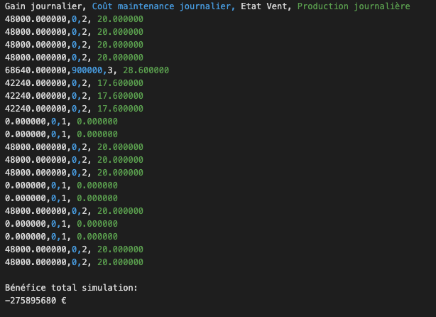
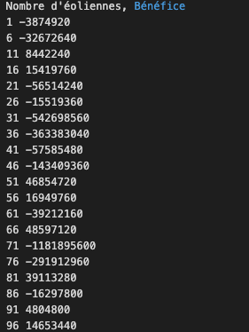

# wind-farm-simulation 💡

## What's that ? 💻
Embarking on my first substantial C project, I found myself delving into the intricate realm of simulating a wind farm. The task at hand was to analyze the energy production of a wind turbine park, considering variables such as wind conditions, the robustness of the turbines, and the overall size of the park. The operational framework was elegantly simplified for the exercise. 

## Instructions
Each wind turbine generated energy based on wind speed, categorized into three levels: no wind (yielding no energy production), moderate wind (production level 1), and strong wind (production level 2). The wind speed remained constant throughout the day, with random changes in speed at the onset of each day, governed by a transition matrix, aptly named V. Adding a layer of complexity, when subjected to strong winds, a turbine had a probability 'p' of malfunctioning, leading to its cessation for maintenance. Thus, this endeavor not only delves into the dynamics of renewable energy production but also introduces the challenge of managing turbine reliability within the dynamic interplay of wind conditions.

## Data 📊
- On the first day:
Wind speed is zero.
All wind turbines are in a new state.

- Probability for a wind turbine to malfunction (only if the wind is strong): p = 0.15
- A wind transition matrix
- Wind turbine production in MW based on wind speed (zero, medium, maximum):
  prod = (0, 0.4, 0.65)
- Maintenance conditions:
  - Maintenance following a malfunction requires a 3-day intervention.
  - Cost of an intervention: 150 k€.
  - The intervention is suspended as long as the wind is strong.
After the intervention, the wind turbine is considered to be in a new state.

## Results

